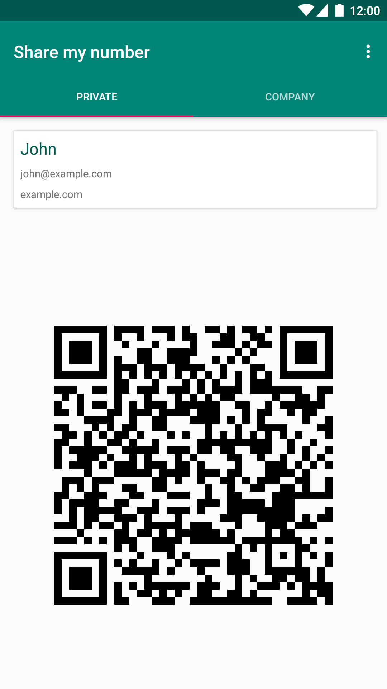
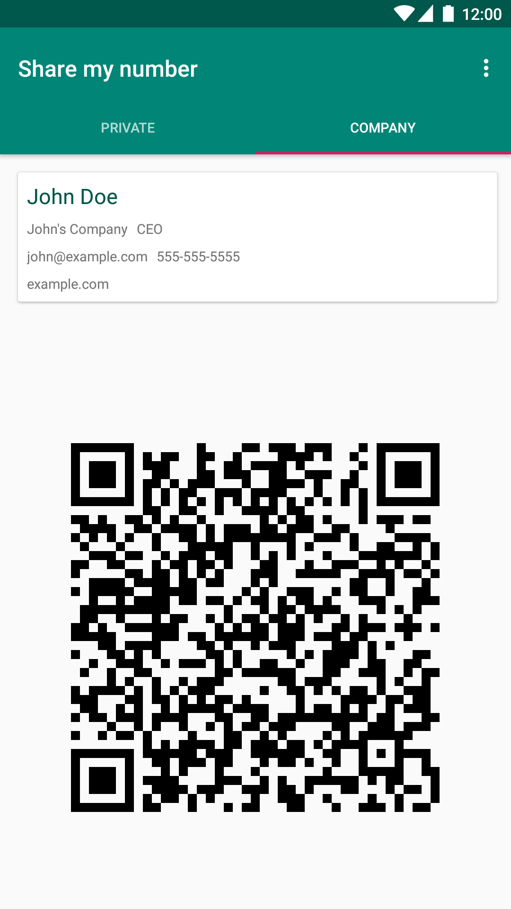
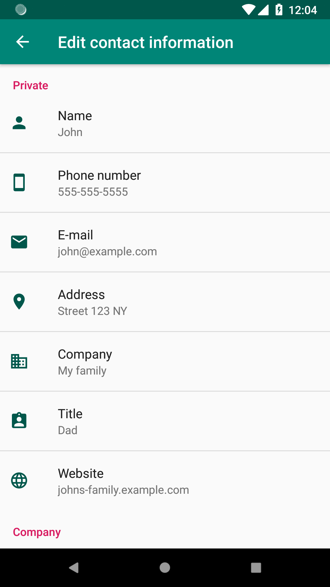

# Share my number
 

This app displays a business card and a QR code. Other people can add your number to their contact app by scanning the QR code.

It's possible to configure three independent profiles: private, company and other. The profile names are just suggestions. Feel free to change them in the settings.

You can share the following information:
* Name
* Phone number
* E-mail
* Address
* Company
* Title
* Website

  

## Translations

Translations are managed via [Crowdin](https://crowdin.com/project/share-my-number). Translations need to be approved before I can merge them. Please do not hesitate to contact me via Crowdin or GitHub issue if you want to become proofreader or if you want to request a language.

## License

Published under [GNU General Public License v3.0 or later](https://spdx.org/licenses/GPL-3.0-or-later.html).

Google Play and the Google Play logo are trademarks of Google LLC.
